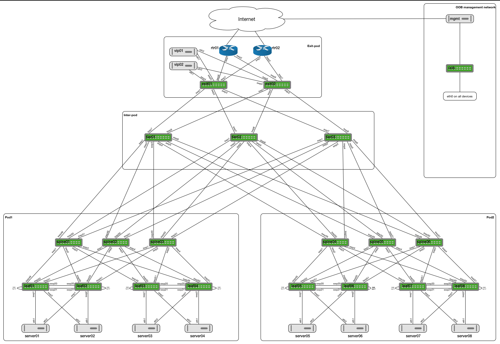

#Cumulus 2pod-3tier VX Topology

This is a large topology built with Cumulus VX using the Topology Generator (https://github.com/CumulusNetworks/topology_converter). This topology can be used to simulate larger networks and features that are needed for these networks.

Since the topology consists out of a large number of nodes, it requires 32G of memory and will not run on a local laptop. Although you could use it when only starting part of the topology (e.g one pod).

